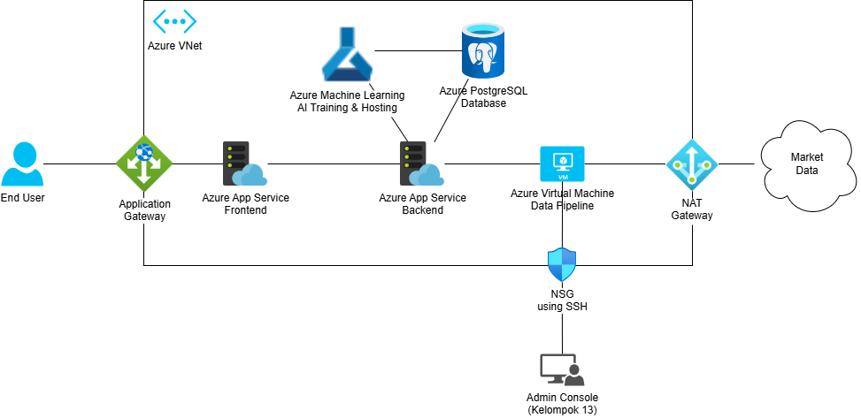

* Nama Kelompok: Info Cuan
* Anggota:
    * Farhan Arief Ramadhan - 22/497297/TK/54496
    * Freddy Tanusina - 20/456841/TK/50665
    * Danella Zefanya Siahaan - 22/492877/TK/53953

# Projek Senior Project TI

## Departemen Teknik Elektro dan Teknologi Informasi, Fakultas Teknik, Universitas Gadjah Mada

---
# Produk
* Nama Produk: Consumerlytics
* Jenis Produk: AI Analytics
---

---
# Latar Belakang & Permasalahan

## Latar Belakang

UMKM memiliki peranan yang cukup banyak dalam perekonomian Indonesia dengan menymbang 85,5% (Sofyan, 2017). Sayangnya, UMKM di Indonesia kurang memanfaatkan digitalisasi (Saprianto, 2020), salah satunya dalam aspek melihat keadaan pasar secara luas dan dalam untuk dijadikan acuan dalam keputusan. Ini menyebabkan berkurangnya efektivitas kegiatan UMKM padahal salah satu faktor terpenting dalam efektivitas kegiatan UMKM adalah pemasaran (Hartono & Hartomo, 2014).

Pengembangan infrastruktur AI di masa ini didukung oleh banyaknya data pasar yang tersedia, bahkan ada juga yang bersifat real-time, dan menurut Arsenio, Abdurrahman, Tania, dan Idaman (2024), berpotensial untuk membantu pelaku UMKM memprediksi tren pasar dengan lebih akurat.

## Rumusan Permasalahan

* Pelaku UMKM kurang paham dengan keadaan dan tren pasar.
* Pelaku UMKM kurang mengintegrasikan usahanya dengan teknologi untuk analisis pasar.
* AI dapat digunakan untuk analisis pasar karena data yang luas dan real-time.
---

---
# Ide Solusi

Pengembangan platform analisis keuangan UMKM berbasis AI untuk memberikan saran yang bergantung pada keuangan internal perusahaan dan tren pasar target perusahaan.

## Fitur-Fitur

* **Input data produk dan inventaris**: Data mencakup kebutuhan produksi, distribusi, penjualan, dan jumlah yang tersedia untuk dijual.
* **Input data keuangan**: Pengelolaan keuangan yang mencatat pemasukan dan pengeluaran secara manual.
* **Saran keputusan usaha oleh AI**: AI akan memperhitungkan bagaimana produk harus dijual berdasarkan keadaan internal perusahaan (inventaris dan keuangan) dan keadaan serta tren pasar.
---

---
# Analisis Kompetitor

## Shopee

* **Jenis Kompetitor**: Tertiary
* **Jenis Produk**: E-Commerce
* **Target Customer**: UMKM yang menggunakan Shopee
* **Kelebihan**:
    * ShopeePay, Shopee Seller Center, dan fitur analitik penjualan, yang membantu UMKM dalam mengelola transaksi dan memahami perilaku pelanggan.
    * Memiliki ratusan juta pengguna aktif sehingga memudahkan pengumpulan data transaksi dan preferensi pelanggan
* **Kekurangan**:
    * Fitur analitik Shopee lebih berfokus pada data transaksi di platform mereka saja, sementara aplikasi Anda bisa memberikan analisis yang lebih luas, misalnya dari berbagai sumber atau metode segmentasi yang lebih mendalam.
* **Key Competitive Advantage & Unique Value**: Shopee sudah melakukan analisis pasar dan melakukan promosi atau diskon yang besar seperti flash sale, gratis ongkir, dan cashback, menarik pelanggan untuk terus berbelanja.

## Google Cloud AI

* **Jenis Kompetitor**: Direct Competitor
* **Jenis Produk**: Analisis data dan Machine Learning
* **Target Customer**: Perusahaan besar & perusahaan e-commerce
* **Kelebihan**:
    * Integrasi kuat dengan Google Services lainnya
    * Kemampuan processing yang sangat cepat
* **Kekurangan**:
    * Harga yang tinggi, terutama untuk pengguna atau perusahaan kecil dan menengah
    * Kurang cocok untuk pengguna non-Google
* **Key Competitive Advantage & Unique Value**: Google Cloud AI dapat menggunakan AI mereka untuk melakukan prediksi tren pasar dan analisa keinginan pelanggan. Google CLoud juga memiliki BigQuery yang mampu menganalisis data besar dengan cepat

## Xero

* **Jenis Kompetitor**: Indirect
* **Jenis Produk**: Accounting Software
* **Target Customer**: Perusahaan menengah hingga perusahaan besar
* **Kelebihan**:
    * Memiliki fitur multi-user
    * Dapat diakses dari perangkat apa pun (desktop, tablet, mobile) 
* **Kekurangan**:
    * Aplikasi berbayar dengan harga paket termurah mulai dari $13/bulan dengan fitur terbatas.
    * Fokus pada pembukuan dan akuntansi, bukan insight pelanggan atau strategi bisnis
* **Key Competitive Advantage & Unique Value**: Xero menawarkan platform akuntansi berbasis cloud yang bisa diakses dari berbagai perangkat kapan saja dan di mana saja dan mendukung integrasi dengan aplikasi pihak ketiga.
---

---

# Cloud Architecture

Diagram tersebut menunjukkan integrasi architecture layer semua komponen Consumerlytics.

* **Frontend**: Frontend menggunakan Azure App Service F1 Plan untuk mendukung aplikasi Next JS.
* **Backend**: Backend menggunakan Azure App Service F1 Plan untuk mendukung aplikasi Express JS. Backend hanya bisa diakses dari IP Address frontend untuk keamanan data dan abstraksi business logic. Tujuan utama backend adalah abstraksi business logic. Artinya data hanya dapat diubah dengan logika tertentu sehingga tidak ada manipulasi data mengurangi integritas data. Backend ini bisa melakukan register, login, logout, CRUD produk, dan mengakses AI.
* **Database**: Database menggunakan Azure Database for Flexible PostgreSQL. Database menyimpan data pengguna, produk, dan tren produk.
* **Model AI**: Model AI menggunakan Vertex AI untuk mendukung model Scikit Learn.

---

---

# AI Modeling

Model prediktif dalam proyek ini dirancang untuk memahami pola harga produk e-commerce berdasarkan kombinasi data transaksi historis dan tren pencarian publik terhadap produk tersebut. Berikut adalah penjelasan konsepnya:

* **Persiapan dan Pembersihan Data**: Dataset transaksi e-commerce dibaca dan disesuaikan dengan struktur yang konsisten, termasuk pengubahan nama kolom, pembuangan data kosong, dan konversi tanggal ke format yang bisa diolah lebih lanjut. Setiap baris data mencerminkan satu transaksi dan mencakup informasi produk, metode pembayaran, status transaksi, harga, dan tanggal.
* **Ekstraksi Fitur Waktu**:Tanggal transaksi diuraikan menjadi fitur-fitur temporal seperti tahun, bulan, hari, hari dalam seminggu, dan apakah transaksi terjadi di akhir pekan. Fitur waktu juga direpresentasikan dalam bentuk numerik dan siklikal (menggunakan fungsi sinus dan kosinus) untuk menangkap pola musiman atau mingguan.
* **Penyandingan Produk dan Tren Google**:Untuk setiap produk tertentu (SKU), dilakukan pencocokan dengan data tren pencarian Google yang relevan. Data ini memberikan indikasi tingkat ketertarikan publik terhadap produk-produk tertentu dalam periode waktu tertentu, dan kemudian dirata-ratakan per bulan.
* **Penggabungan Data Transaksi dan Tren**:Data tren digabungkan dengan data transaksi berdasarkan SKU, tahun, dan bulan. Hal ini memungkinkan model untuk memahami hubungan antara popularitas suatu produk (berdasarkan tren) dan harga aktualnya di pasar.
* **Normalisasi dan Deteksi Outlier**:Harga dinormalisasi untuk konsistensi dan diolah lebih lanjut dengan teknik deteksi dan pemangkasan outlier berbasis rentang interkuartil (IQR). Ini membantu memastikan bahwa model tidak terlalu dipengaruhi oleh data yang ekstrem atau anomali.
* **Transformasi dan Interaksi Fitur**:Fitur baru diturunkan dari data tren dan kategorisasi, seperti log-trend, kuadrat dari tren, interaksi antara tren dan kategori produk, serta perbedaan harga dari waktu ke waktu (misalnya percepatan dan deviasi harga dari rata-rata bergulir).
* **Kategorisasi dan Encoding**:Kolom seperti metode pembayaran dan status transaksi dikategorikan ulang ke dalam kelompok yang lebih berarti (misalnya, cash_based, credit, success, failure), lalu diubah ke format numerik menggunakan teknik label encoding untuk digunakan dalam proses pembelajaran mesin.
* **Pembuatan Fitur Historis**:Model juga mempertimbangkan dinamika waktu seperti perubahan harga antar bulan, harga rata-rata sebelumnya, dan arah perubahan harga. Fitur-fitur ini penting untuk menangkap tren historis dalam perilaku konsumen dan harga produk.

---

---

# Jaringan Komputer

Terdapat beberapa komponen cloud yang saling berkomunikasi pada Consumerlytics, yaitu frontend, backend, database, dan AI model. Komponen-komponen tersebut saling berkomunikasi dengan topologi dan protokol komunikasi tertentu.

* **Frontend**: Frontend harus bisa diakses oleh pengguna dari mana saja, maka digunakan website dengan protokol HTTP seperti pada umumnya yang digunakan website.
* **Frontend-Backend**: Backend diakses oleh frontend dengan protokol HTTP untuk bertukar paket informasi. Demi keamanan, backend hanya mengizinkan IP address frontend untuk mengakses endpoint.
* **Backend-Database**: Database diakses oleh backend dengan protokol TCP untuk bertukar data dengan volume besar secara reliable.
* **Backend-AI Model**: Model AI diakses oleh backend dengan protokol HTTP untuk bertukar paket informasi seperti REST API pada umumnya.

---

# Cloud Computing

Semua komponen pada Consumerlytics (frontend, backend, database, dan model AI) di-deploy dalam cloud. Ini bertujuan untuk meningkatkan accessibility Consumerlytics agar dapat diakses kapan saja, availability untuk mengurangi down time akibat development atau musibah, dan scalability untuk memberikan ruang upgrade yang fleksibel.

* **Frontend**: Frontend dideploy ke Azure App Service. Ini bertujuan untuk akses melalui browser yang mudah,
* **Backend**: Backend juga dideploy ke Azure App Service. Ini bertujuan untuk availability service dan keamanan akses data hanya melalui frontend.
* **Database**: Database dideploy ke Azure Database for PostgreSQL. Ini bertujuan untuk availability service.
* **Model AI**: Model AI dideploy ke Vertex AI. Ini bertujuan untuk accessibility komputasi intensif pada cloud.

---

---
# Daftar Pustaka

* Sofyan, S. (2017, Juni) PERAN UMKM (USAHA MIKRO, KECIL, DAN MENENGAH) DALAM PEREKONOMIAN INDONESIA. Diakses pada 15 Februari 2025 dari https://jurnal.uindatokarama.ac.id/index.php/blc/article/download/298/216
* Saprianto, F. (2020, 1 Januari) DILEMATIS UMKM DI ERA DIGITAL. Diakses pada 15 Februari 2025 dari https://media.neliti.com/media/publications/296689-dilematis-umkm-di-era-digital-bb78fa90.pdf
* Hartono, & Hartomo, D. D. (2014) FAKTOR-FAKTOR YANG MEMPENGARUHI PERKEMBANGAN UMKM DI SURAKARTA. Diakses pada 15 Februari 2025 dari https://jurnal.uns.ac.id/jbm/article/view/2678 
* Arsenio, D., Abdurrahman, Y., Tania, A. L., Idaman, N. (2024) Peran dan Praktik Artificial Intelligence terhadap UMKM. Diakses pada 15 Februari 2025 dari https://ejournal.sisfokomtek.org/index.php/jumin/article/download/4612/2933/33525
* Marco Lagi, Yavni Bar-Yam, Karla Z. Bertrand, and Yaneer Bar-Yam (2015) Accurate market price formation model with both supply-demand and trend-following for global food prices providing policy recommendations. Diakses pada 13 Mei 2025 dari Accurate market price formation model with both supply-demand and trend-following for global food prices providing policy recommendations dari https://www.pnas.org/doi/10.1073/pnas.1413108112
---
